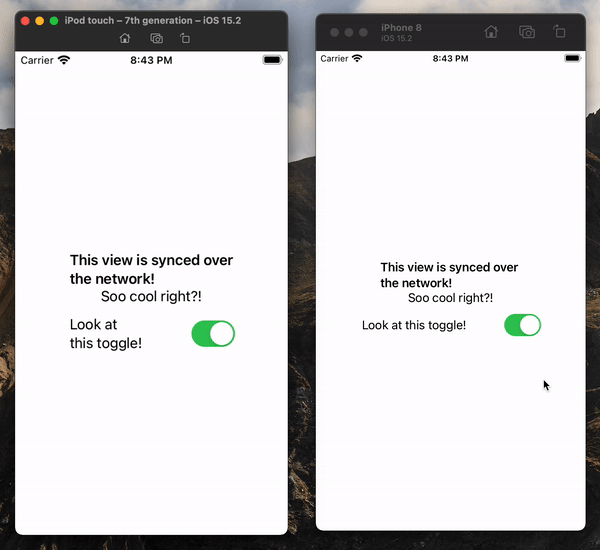

<p align="center">
    
</p>

<p align="center">
    
    <a href="https://swift.org/package-manager">
        
    </a>
    <a href="https://twitter.com/nerdsupremacist">
        
    </a>
</p>

# Sync
Sync is a proof of concept for expanding on the Magic of ObservableObject, and making it work over the network. 
This let's you create real-time Apps in which your Observable Objects are in sync across multiple devices.
This has a lot of applications just as:
- IoT Apps
- Multi-Player Mini Games
- etc.

As of right now Sync works out of the box using WebSockets, however, it's not limited to web sockets and it allows for multiple kinds of connections. Some possible connections could be:
- Bluetooth
- Multi-Peer
- MQTT
- etc.

The sky is the limit!

**Warning:** This is only a proof of concept that I'm using for experimentation. I assume there's lots and lots of bugs in there...

## Installation
### Swift Package Manager

You can install Sync via [Swift Package Manager](https://swift.org/package-manager/) by adding the following line to your `Package.swift`:

```swift
import PackageDescription

let package = Package(
    [...]
    dependencies: [
        .package(url: "https://github.com/nerdsupremacist/Sync.git", from: "1.0.0")
    ]
)
```

## Usage

If you have ever used Observable Object, then Sync will be extremely easy to use. 
For this example we will create an app with a Switch that everyone can flip on or off as they like. We will build this using SwiftUI, WebSockets and a Vapor Server. Final code available [here](https://github.com/nerdsupremacist/SyncExampleApp).

<p align="center">
    
</p>

For this we will need a few additional packages:
- [Vapor](https://vapor.codes): To create a Web Server that will sync our devices
- [SyncWebSocketClient](https://github.com/nerdsupremacist/SyncWebSocketClient): The client code for using WebSockets
- [SyncWebSocketVapor](https://github.com/nerdsupremacist/SyncWebSocketVapor): A utility to make it easy to serve our object via a WebSocket

Let's start by building our shared ViewModel. This is easy, instead of using `ObservableObject` we use `SyncableObject`. And instead of `Published` we use `Synced`:
```swift
class ViewModel: SyncableObject {
    @Synced
    var toggle: Bool = false

    init() { }
}
```

This ViewModel needs to be both on your App codebase as well as on the Server codebase. I recommend putting it in a shared Swift Package, if you're feeling fancy.

Next stop is to create our server. In this example every client will be using the exact same ViewModel. So we're creating a Vapor application, and using `syncObjectOverWebSocket` to provide the object:

```swift
import Vapor
import SyncWebSocketVapor

let app = Application(try .detect())

let viewModel = ViewModel()
app.syncObjectOverWebSocket("view_model") { _ in
    return viewModel
}

try app.run()
```

For our SwiftUI App, we need to use two things:
- @SyncedObject: Like [ObservedObject](https://developer.apple.com/documentation/swiftui/observedobject), but for Syncable Objects. It's a property wrapper that will dynamically tell SwiftUI when to update the UI
- Sync: A little wrapper view to start the remote session

Our actual view then uses SyncedObservedObject with our ViewModel
```swift
struct ContentView: View {
    @SyncedObject
    var viewModel: ViewModel

    var body: some View {
        Toggle("A toggle", isOn: $viewModel.toggle)
            .animation(.easeIn, value: viewModel.toggle)
            .padding(64)
    }
}
```

And in order to display it we use Sync, and pass along the Web Socket Connection:
```swift
struct RootView: View {
    var body: some View {
        Sync(ViewModel.self, using: .webSocket(url: url)) { viewModel in
            ContentView(viewModel: viewModel)
        }
    }
}
```

## Contributions
Contributions are welcome and encouraged!

## License
Sync is available under the MIT license. See the LICENSE file for more info.
